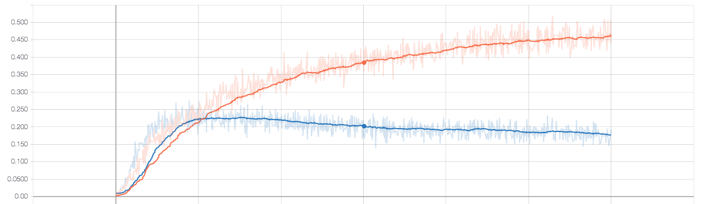

# tiny_imagenet

Submit the results -- not working:
https://tiny-imagenet.herokuapp.com/

## Approach:

- Data explorations
- Convolutional Neural Network
Data Augmentation
Dropouts
Regularization
Learning rate decay

- Filter visualization
- Saliency Maps

## Findings
Simple training the CNN model by feeding epochs of data will quickly overfit the model.

## Resources:
[paper0](http://cs231n.stanford.edu/reports/2016/pdfs/425_Report.pdf)
[paper1](http://cs231n.stanford.edu/reports/2017/pdfs/931.pdf)
[paper2](http://cs231n.stanford.edu/reports/2015/pdfs/superfsm_final.pdf)
[VGGNet and Tiny ImageNet](https://learningai.io/projects/2017/06/29/tiny-imagenet.html)